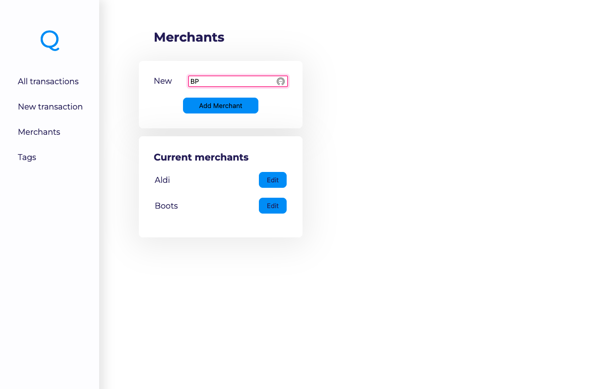
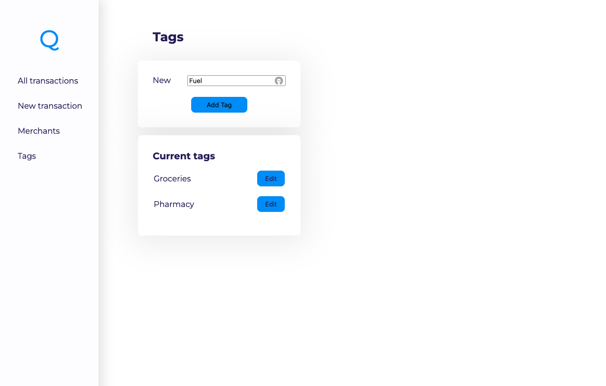
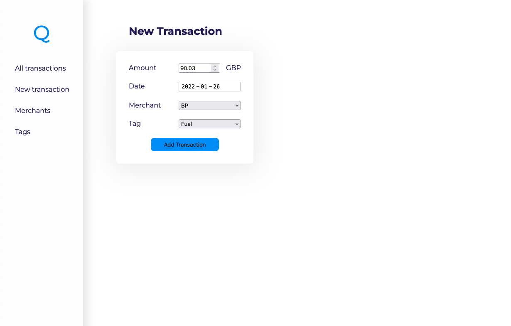
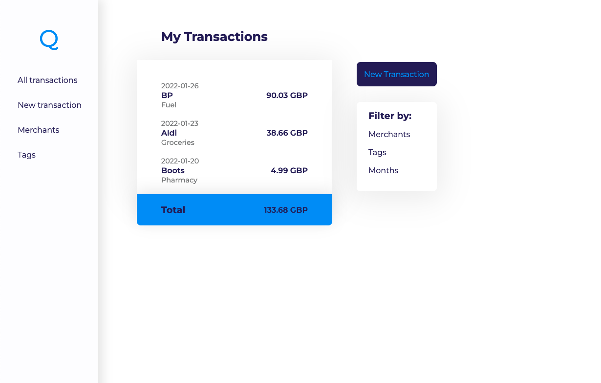
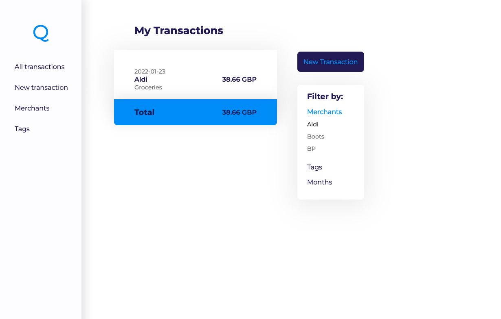

# spending_tracker
<h2>Python full stack app project</h2>

The spending tracker is an app for the user to manage their transactions.

<h3>MVP</h3>

The user can create and edit tags and merchants and then add transactions with an amount, choose the date and assign a merchant and tag to it. To get an overview the user can see all the transactions on one page with the total amount of all the transactions. 

<h3>Extensions</h3>

The user is able to filter the view by merchant, tag or a specific month.

<h3>Technologies</h3>
<ul>
    <li>SQL</li>
    <li>psycopg2</li>
    <li>Python</li>
    <li>Flask</li>
    <li>HTML</li>
    <li>CSS</li>
</ul>

<h3>How to run the app</h3>
<ol>
    <li>Download code or clone it to your computer</li>
    <li>Open up the terminal</li>
    <li>To make sure you have PostgreSQL installed to run the database, write in your terminal: which psql (if not you need to install it)</li>
    <li>cd into the git repository</li>
    <li>To set up the local database, in your terminal write: createdb spending_tracker</li>
    <li>Now to execute PostgreSQL scripts write: psql -d spending_tracker -f db/spending_tracker.sql</li>
    <li>To run the app in your browser you will need flask installed</li>
    <li>When you are sure you have flask installed you can write: flask run</li>
    <li>This will give you a URL beginning with 127.0.0.1, open this up in your browser</li>
    <li>The application is now ready!</li>
</ol>

* To exit out of flask in your terminal do ctrl+c

<h3>Images of application</h3>

